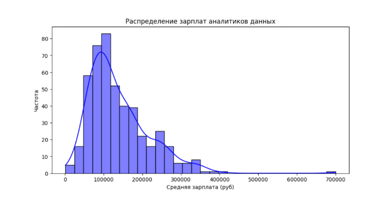
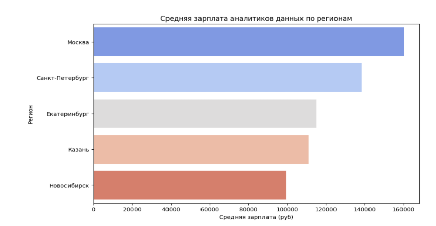
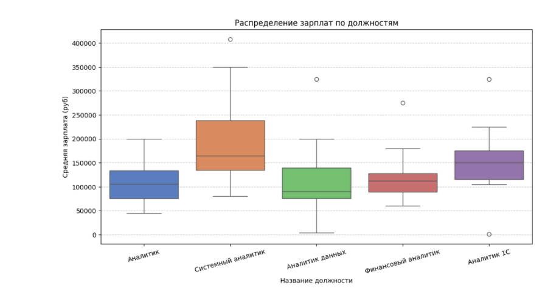

# hh_vacancies_analytics
Анализ вакансий аналитика данных с hh.ru: сбор данных, EDA, визуализации
## 🧠 Анализ рынка труда: востребованные профессии и навыки в сфере аналитики данных

Проект демонстрирует навыки аналитики данных, визуализации и подготовки выводов.  
Данные: В рамках анализа были использованы данные, собранные с сайта HeadHunter с помощью API.
Исследование охватывает вакансии, относящиеся к следующим направлениям:
- Аналитик данных (Data Analyst)
- Бизнес-аналитик (Business Analyst)
- Системный аналитик (System Analyst)
- Финансовый аналитик (Financial Analyst)
- Маркетинговый аналитик (Marketing Analyst)
Размерность датасета составляет 1171 строка и 10 столбцов

## 🎯 Цели проекта
- [Цель 1: Составить рейтинг наиболее востребованных навыков и инструментов для начинающих аналитиков]
- [Цель 2: Сравнить рынок труда по городам и выделить регионы с наибольшим количеством вакансий и высоким уровнем оплаты]
- [Цель 3: Оценить Распределение зарплаты востребованных должностей]

## 🛠 Инструменты и библиотеки
- Python 3.10+
- pandas
- numpy
- matplotlib
- seaborn

  ## 🔍 Ход анализа
1. **Загрузка и обзор данных**  
   - 1171 строка и 10 столбцов
   - Много пустых значения в признаках "Зарплата от" и "Зарплата до"  

2. **Предобработка**  
   - После удаления дубликатов и пустых значений в датасете осталось 473 вакансии 

  ## 📊 Визуализация  
  **Востребованные навыки**
   

   Топ-5 востребованных навыков:
- Аналитическое мышление (как ключевая компетенция)
- SQL (основной инструмент работы с данными).
- MS Excel (классический инструмент аналитика)
- BPMN (построение бизнес моделей)
- Системный анализ (методы решения задач)

**Востребованные навыки в высокооплачиваемых вакансиях**
   
   
   По сравнению с прошлым графиком, в этом анализе мы отобрали 30% самых оплачиваемых вакансий и посмотрели какие именно навыки указаны в них. Можно сделать вывод о том, что SQL сильно необходим при трудоустройстве на высокооплачиваемые вакансии в сфере аналитики данных, чуть меньше ценится система BPMN, которая предназначена для построения бизнес моделей.

**Распределение зарплат**
   
   
- Средняя зарплата специалистов в сфере аналитики данных составляет ≈120 000 руб.
- Большая часть вакансий предлагает зарплату в диапазоне от 70 000 до 150 000 руб.
- Верхний порог зарплат достигает 700 000 руб., но это редкие случаи, связанные с топовыми позициями.

**Распределение зарплат по регионам**
   

   При построении графика, мы столкнулись с проблемой, что в датасет попали прочие города в единичном экземпляре, что портило адекватность данных и их пришлось исключить. Скорее всего, это произошло, потому что работодатель размещал вакансии сразу на несколько городов. Вот какие выводы можно сделать:
- Самые высокооплачиваемые зарплаты размещаются в столице, а то есть в г. Москва
- Также проявляется зависимость о том, что чем меньше численность населения в городе, тем и меньше «Средняя з/п» аналитика данных в регионе. Исключением здесь является Казань, но это, скорее всего, связано с развитием города в направлении IT.

**Распределение зарплаты востребованных должностей**
   
   Можно сделать вывод о том, что самая оплачиваемая профессия — это «Системный аналитик», его медианная з/п составляет ~160 тыс. руб., в то время как про должности «Аналитик» и «Аналитик данных» сложно что-либо сказать, так как это довольно обобщенные названия должностей.

## 💬 Основные выводы и рекомендации
Основные выводы:
- Самая высокая концентрация вакансий и зарплат — в Москве.
- Средняя зарплата в аналитике данных ≈120 000 руб., но сильно варьируется в зависимости от региона и опыта.
- Наиболее востребованные навыки: SQL, Аналитическое мышление, системный анализ, MS Excel.

  Рекомендации для соискателей:
- Освоить SQL, BPMN и UML, так как они востребованы на всех аналитических позициях.
- Развивать аналитическое мышление и умение работать с данными.
- Рассматривать Москва и Санкт-Петербург как основные регионы для высокооплачиваемой работы.
