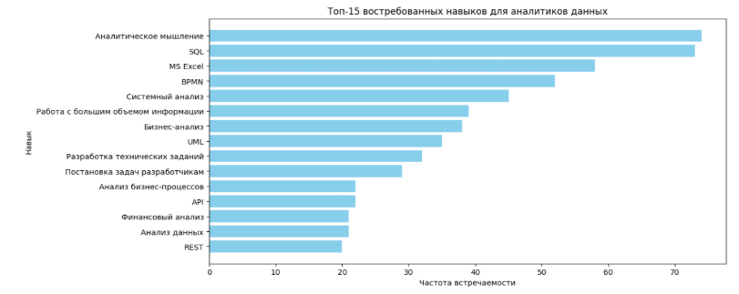
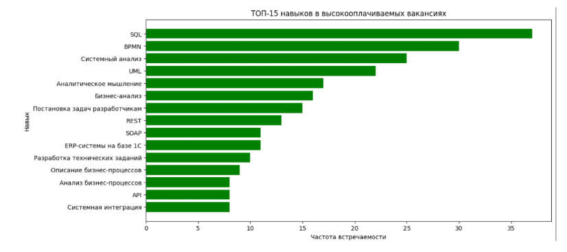

# hh_vacancies_analytics
Анализ вакансий аналитика данных с hh.ru: сбор данных, EDA, визуализации
## 🧠 Анализ рынка труда: востребованные профессии и навыки в сфере аналитики данных

Проект демонстрирует навыки аналитики данных, визуализации и подготовки выводов.  
Данные: В рамках анализа были использованы данные, собранные с сайта HeadHunter с помощью API.
Исследование охватывает вакансии, относящиеся к следующим направлениям:
- Аналитик данных (Data Analyst)
- Бизнес-аналитик (Business Analyst)
- Системный аналитик (System Analyst)
- Финансовый аналитик (Financial Analyst)
- Маркетинговый аналитик (Marketing Analyst)
Размерность датасета составляет 1171 строка и 10 столбцов

## 🎯 Цели проекта
- [Цель 1: Составить рейтинг наиболее востребованных навыков и инструментов для начинающих аналитиков]
- [Цель 2: Сравнить рынок труда по городам и выделить регионы с наибольшим количеством вакансий и высоким уровнем оплаты]
- [Цель 3: Оценить Распределение зарплаты востребованных должностей]

## 🛠 Инструменты и библиотеки
- Python 3.10+
- pandas
- numpy
- matplotlib
- seaborn

  ## 🔍 Ход анализа
1. **Загрузка и обзор данных**  
   - 1171 строка и 10 столбцов
   - Много пустых значения в признаках "Зарплата от" и "Зарплата до"  

2. **Предобработка**  
   - После удаления дубликатов и пустых значений в датасете осталось 473 вакансии 

  ## 📊 Визуализация  
  Востребованные навыки
   

   Топ-5 востребованных навыков:
- Аналитическое мышление (как ключевая компетенция)
- SQL (основной инструмент работы с данными).
- MS Excel (классический инструмент аналитика)
- BPMN (построение бизнес моделей)
- Системный анализ (методы решения задач)

Востребованные навыки в высокооплачиваемых вакансиях
   
   
